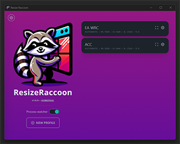
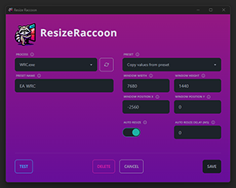

<p align="center">
  
</p>

# Resize Raccoon

> A Windows window resize manager.

## Features

- **Automatic Window Resizing**: Set your preferred window dimensions and let Resize Raccoon do the rest.
- **Accessible Profiles**: Create profiles for different applications and scenarios.
- **Match profile to process once**: After defining a profile you dont need to match it to the process again, manually trigger the preset with a single click as long as the target program is running


[](./public/home-screenshot.png)
[](./public/profile-screenshot.png)

## Installing

To install Resize Raccoon, head over to the [Releases](https://github.com/mistenkt/resize-raccoon/releases) section and download the latest version for your operating system.

## Usage

After installing Resize Raccoon, you can create custom profiles for your applications:

> #### NOTE: 
> Some applications / games do a lot of fuckery with their window during startup that will prevent the resizing to take effect or persisting. 
> - If manually applying the profile you should usually wait for the intros to finish and the main menu to appear. 
> - If using process watcher you should set a delay long enough for the fuckery to end. (the amount of delay required varies, from none to 20-30 seconds (EA WRC 23))

> Working on a better solution for this were no manual intervention or magic delay timers are needed. Check the [Roadmap](./docs/ROADMAP.md) for more info about upcoming feautures.

1. Open the Resize Raccoon interface.
2. Add a new profile by specifying the target application process, name, size and position and whatever else is there.
    1. If you are unsure about the values you can use some of the presets created for different triple monitor setups.
    2. You can test your profile before saving it to verify that it works. 
    3. Enable "Auto-Resize" to allow this profile to be automatically applied when your target process is launched.
    4. You can add a custom delay if we need to wait a little before resizing.
3. Once a profile is saved you will see it on the main screen, clicking the little window square on the profile will manually trigger the resize.
4. For the automatic resize to work, you need to enable process watching on the home screen.
5. Minimize to system tray and dont worry about having to resize your applications manually everytime you launch them again. 
6. Polling interval can be ajusted in the sidebar. It is set to 1000ms by deafult, in my testing it was very resource friendly so it shouldnt be problem.

NB. There could be cases where the process you are trying to resize wont allow you unless you run `ResizeRaccoon` as admin.

## Running Locally

To run Resize Raccoon locally for development or personal use, follow these steps:

1. Clone the repository:
   ```sh
   git clone https://github.com/mistenkt/resize-raccoon.git```
2. Navigate to the project directory
    ```sh
    cd resize-raccoon
    ```
3. Install the necessary dependencies:
    ```sh
    cargo install tauri-cli
    ```
4. Run the application in development mode:
    ```sh
    cargo tauri dev
    ```

## Motivation and Inspiration
I need a way to resize borderless windows to span across 3 monitors when playing certain Sim Racing games, and i hate Nvidia Surround.

Inspired by [Simple Runtime Window Editor (SRWE)](https://github.com/dtgDTGdtg/SRWE) which has a bunch more features, but didnt have a sollution for automatically applying profiles to processes. You also had to manually select the process every time which was a bit tedious. Great app tho, but hasnt received updats in many years.

I also wanted to try coding with Rust.

## Why Raccoon?
Idk, it sounded cute and im sure if they had access to the Windows API they would be great at managing your windows.

## Technologies and frameworks used

- Rust
- Tauri
- Typescript
- React
- ChatGPT for some of the Rust/Tauri stuff.
- Dall-E for the cute illustration. 

## Contributing
Feel free to open PRs, or suggest features!